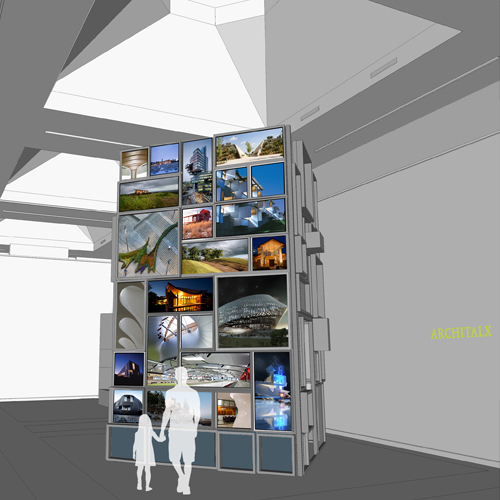
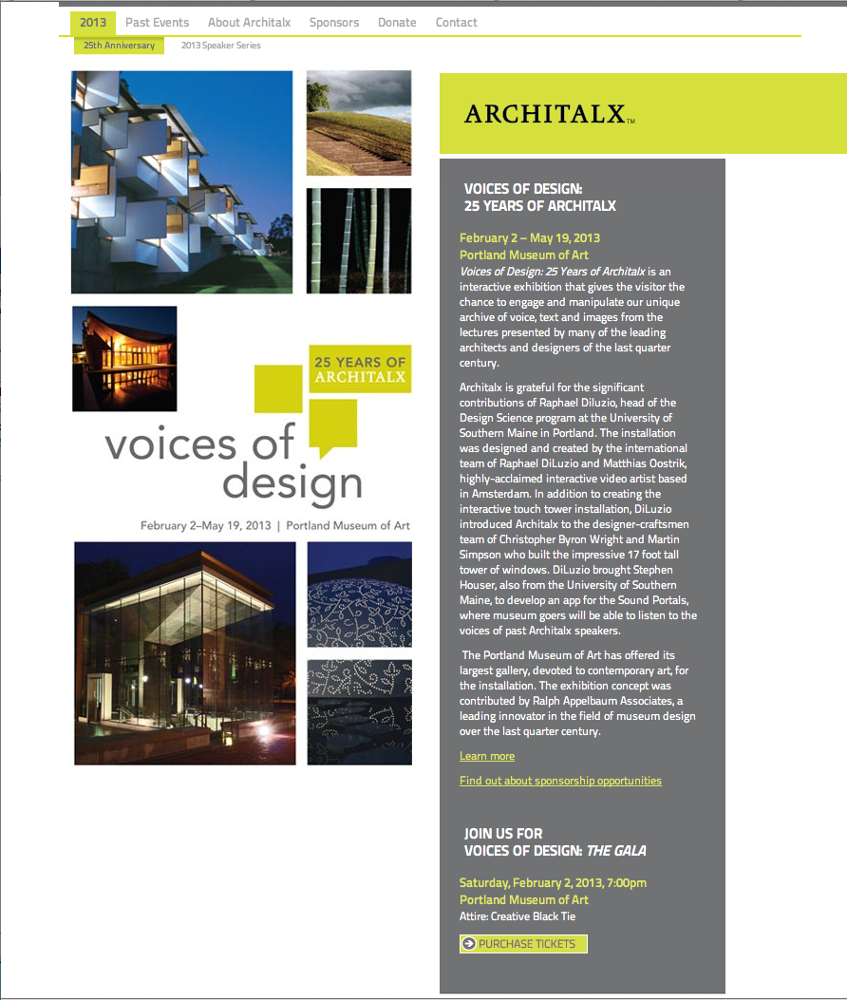

An interactive audio controller app that mimics the 17-foot interactive tower as part of <a href="http://www.architalx.org">Architalx's</a> 25th anniversary exhibit, "Voices of Design: 25 Years of Architalx." At the <a href="http://www.portlandmuseum.org/">Portland Museum of Art</a> from February 2nd through May 19th, 2013. In collaboration with <a href="http://www.raphaeldiluzio.com">Raphael DiLuzio</a> and <a href="http://www.magdatt.nl">Matthias Oostrik.</a> The iPad app controls the audio portals and allows visitors to listen to snippets of audio from past lectures on architecture by visiting architects.

### Screenshots and Videos

### The Code
I am still considering if and how to release the code. So you will just have to enjoy the screenshots and video here or see me in person to get a live demo.

