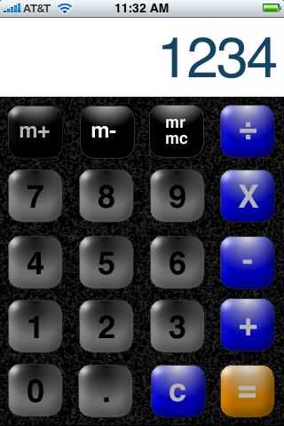

A native iPhone calculator application. The interface is based on the distributed iPhone calculator application. The goal was to cplay around with iPhone development It is really a base to flesh out the basic functionality and a platform to build more on, if I have time.  Available on <a href="http://code.google.com/p/iphcalc/">Google Code</a>.

