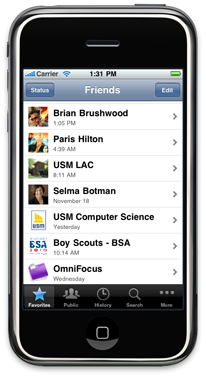
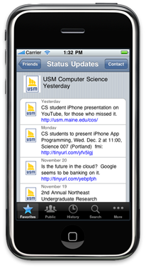
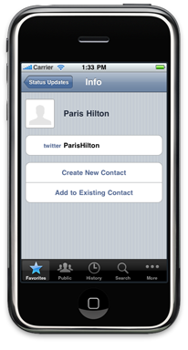

An Implementation of a <a href="http://twitter.com">Twitter</a> application built while offering an independent study course over the summer of 2009. The application is based on specifications from <a href="http://stanford.edu">Stanford's</a> <a href="http://www.stanford.edu/class/cs193p/">CS 193P</a> course. The <a href="http://usm.maine.edu">USM</a> version of the course is in my <a href="../courses.html">courses</a> section and is <a href="../cos497/index.html">COS 497 - iPhone Application Programming</a>.

## Screenshots

## The Code

The code is not available as future courses may be working on the same assignment. Also, this is not an application going to the <a href="http://apple.com/store">Apple AppStore</a> anytime soon. So you will just have to enjoy the screenshots here or see me in person to get a live demo.

